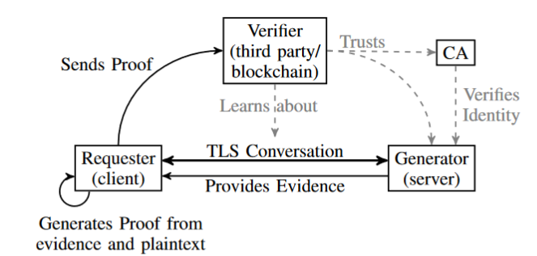
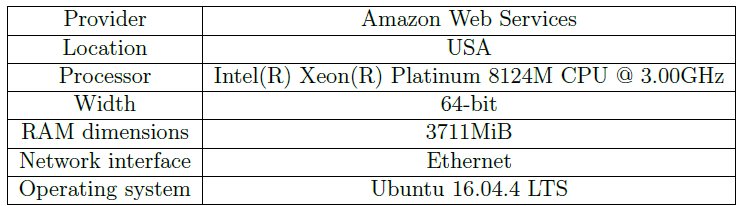
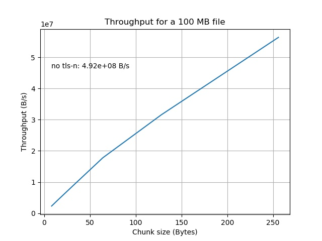

# TLS-N

TLS-N [1] is an extension of the TLS protocol developed at ETH Zurich that guarantees the non-repudiation of the TLS session. This repository contains an implementation of the TLS-N extension for OpenSSL [2], a popular tool used for securing internet connections.

In order to view the specific code changes made to implement TLS-N, please see [the relevant diff view](https://github.com/FDeRubeis/tls-n/commit/f6fa07961c9e6db87dce16cba07bbf1641eae2fe).

## Table of contents
- [TLS-N](#tls-n)
  - [Table of contents](#table-of-contents)
  - [TLS-N](#tls-n-1)
    - [Technical design](#technical-design)
    - [Usage](#usage)
  - [Additional information](#additional-information)
    - [Hiding sensitive information](#hiding-sensitive-information)
    - [Performance tests](#performance-tests)
  - [The code](#the-code)
  - [References](#references)

## TLS-N

An internet user who wants to share an observed content is typically limited to primitive techniques like screenshots and copy-pasting. However, the content produced with these tecnhiques is easily forgeable and can not be considered reliable proof. 

With TLS-N, a client can request a server to create a digital signature of the TLS session, called "evidence". The server will generate the evidence with their private TLS key, which makes it verifiable by any third party that has the server's public TLS key.

TLS-N is designed to enable distributed blockchain oracles. For more details on this application and other potential use cases, please refer to the original paper [1].

### Technical design

The TLS-N protocol involves three parties: the Generator, the Requester and the Verfier. It consists of the following steps:
1. **Negotiating the extension**: the Generator and the Requester start by establishing a TLS session. Typically, the Requester is the client of the TLS session, whereas the Generator is the server. During the handshake, the Requester declares their intention to use the TLS-N extension and negotiates the parameters with the Generator.
2. **Requesting evidence**: at any point during the session, the Requester can ask for the **evidence** which, as previously explained, is essentially the digital signature of the session's content. 
3. **Creating the proof**: when the Requester wants to share the session's content, they generate the **proof**, which is made of the following:
    - the evidence
    - the session's content
    - the Generator's certificate chain
4. **Sending the proof**: the Requester sends this proof to the Verifier.
5. **Verifying the content**: the Verifier finds the Generator's public key in the certificate chain and can use it to verify the evidence. This guarantees the authenticity of the session content.

The diagram below provides a visual summary of the TLS-N protocol: 
  

Thanks to the TLS-N extension, as long as the Verifier trusts the CA that signed the Generator's certificate, they will be able to verify the authenticity of the session's content. No trust in the Requester is needed.

To meet these security objectives while minimizing the performance impact, TLS-N introduces additional functionalities to the TLS send/receive operations. For a deeper dive into this aspect of TLS-N, please refer to the original paper [1]. 

### Usage

In this repository, the TLS-N functionalities have been integrated into the low-level workflow of the TLS's send/receive operations, making them transparent to the end user. To use the TLS-N extension, the end user only needs to call the following functions:
- `SSL_CTX_set_tlsn_extension_client/server()` to negotiate the extension 
- `SSL_tlsn_request_evidence()` to request the evidence
- `SSL_tls_get_proof_string()` to generate the proof

An example of a client and server application that uses TLS-N can be found in the [extension's unit test](https://github.com/FDeRubeis/tls-n/blob/master/test/tls13tlsntest.c).

## Additional information

### Hiding sensitive information

TLS-N offers an additional feature: when sharing the proof, the Requester can choose to hide specific chunks of the session’s content without affecting the proof’s validity. This allows the Requester to protect sensitive data, such as passwords or other private information.

At the beginning of the TLS-N session, the Requester and the Generator will negotiate the "chunk size". This parameter determines the size of the chunks that the Requester can hide. A smaller chunk size grants the Requester finer control on the information they want to hide, however this comes at a price: the performance of the extension decreases.

### Performance tests

The code in this repository was used to evaluate the performance of the TLS-N extension. To this purpose, two hosts were configured on Amazon Web Services(AWS) EC2 with the following settings:

The hosts were located in the same data center.  

The throughput test measured the time taken by one host to send a 100 MB file to the other:
  

As shown, the chunk size significantly impacts throughput. As the chunk size varies between 4 B and 250 B, the throughput goes from 2 MB/s to 40 MB/s. This is between one and two orders of magnitude lower than 100 MB/s, i.e. the throughput without TLS-N.

Further performance tests (e.g. round-trip latency, Merkle tree computation time, etc...) are beyond the scope of this introduction, but those interested are welcome to contact me for more details.

## The code

As previously mentioned, the TLS-N code can be found in this [diff view](https://github.com/FDeRubeis/tls-n/commit/f6fa07961c9e6db87dce16cba07bbf1641eae2fe).

The [tls13_tlsn.c](https://github.com/FDeRubeis/tls-n/blob/master/ssl/tls13_tlsn.c) file contains the main functions implementing the logic of the extension. These functions are integrated into the TLS's send/receive routines in [rec-layer_s3.c](https://github.com/FDeRubeis/tls-n/commit/f6fa07961c9e6db87dce16cba07bbf1641eae2fe#diff-9ad003bc718a126e8376b7542b345cb18ac87cc757304951bbac5f5579d2fbdd) and [ssl3_record.c](https://github.com/FDeRubeis/tls-n/commit/f6fa07961c9e6db87dce16cba07bbf1641eae2fe#diff-a4131b6fe8ab7af35f45112ef26d47767c8b35f76466c1468e8cad0f381d1ef8).

## References

[1] https://eprint.iacr.org/2017/578   
[2] https://github.com/openssl/openssl  

